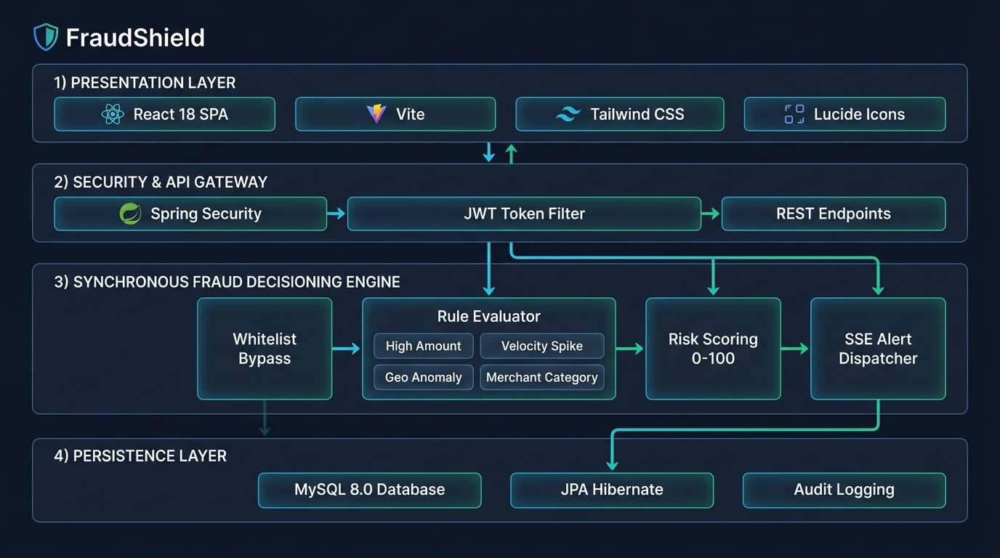
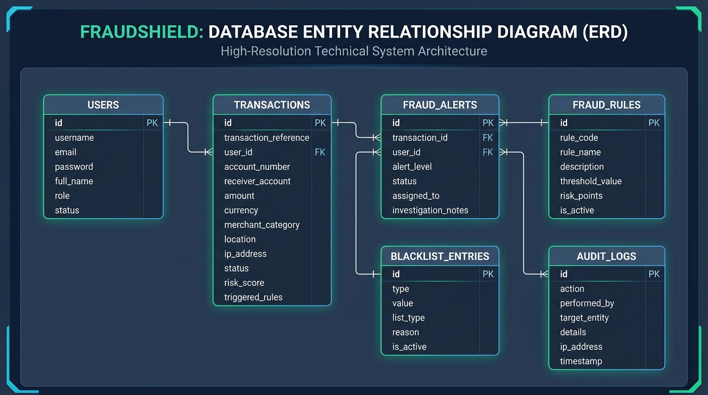

# FraudShield: Real-Time Transaction Monitoring & Fraud Decisioning System


**FraudShield** is an enterprise-grade, high-throughput real-time transaction monitoring, decisioning, and risk management platform built using a modern decoupled 3-tier microservice architecture:
- **`db/`**: MySQL DDL/DML database scripts (`schema.sql` & `data.sql`) and phpMyAdmin setup guide (`http://localhost/phpmyadmin/`).
- **`backend/`**: Java 17 Spring Boot REST API service with Spring Security, JWT authentication, dynamic synchronous Fraud Engine, JPA persistence, and CSV reporting.
- **`frontend/`**: Modern React SPA (Vite + Tailwind CSS + Lucide Icons + Recharts) featuring role-based portals (User Payment submission vs Admin Executive Dashboard, Case Triage Workbench, Rule Configuration Engine).

---

## 🏛️ System Architecture & Execution Pipeline



FraudShield evaluates financial transfers synchronously in sub-15ms latency across four decoupled tiers:
1. **Presentation Layer**: React 18 Single-Page Application (Vite, Tailwind CSS, Recharts, Lucide Icons, SSE Hub).
2. **Security & API Gateway**: Spring Security 6, stateless JWT token authentication filter, and REST endpoints.
3. **Synchronous Fraud Engine**: Whitelist bypass pre-check, multi-rule evaluation (`HIGH_AMOUNT`, `VELOCITY_SPIKE`, `GEO_ANOMALY`, `HIGH_RISK_MERCHANT`), dynamic risk scoring (0–100), and Server-Sent Events (SSE) live alert dispatch.
4. **Persistence Layer**: MySQL 8.0 ACID relational database, JPA Hibernate ORM, and immutable security audit logs.

---

## 🗄️ Database Architecture & Core Entity Relationship Map

### 1. Entity Relationship Diagram (ERD)



```
       +-----------------------+              +-----------------------+
       |         USERS         | 1          * |     TRANSACTIONS      |
       +-----------------------+--------------+-----------------------+
       | id (PK)               |              | id (PK)               |
       | username (UNIQUE)     |              | transaction_reference |
       | email (UNIQUE)        |              | user_id (FK -> users) |
       | password (BCrypt)     |              | account_number        |
       | full_name             |              | receiver_account      |
       | role (ADMIN/USER)     |              | amount                |
       | status (ACTIVE/LOCKED)|              | currency              |
       | created_at, updated_at|              | merchant_category     |
       +-----------------------+              | location, ip_address  |
                   | 1                        | status, risk_score    |
                   |                          | triggered_rules       |
                   |                          | created_at            |
                   |                          +-----------------------+
                   |                                      | 1
                   |                                      |
                   | *                                    | 1
       +-----------------------+              +-----------------------+
       |      AUDIT_LOGS       |              |     FRAUD_ALERTS      |
       +-----------------------+              +-----------------------+
       | id (PK)               |              | id (PK)               |
       | action                |              | transaction_id (FK)   |
       | performed_by          |              | user_id (FK -> users) |
       | target_entity         |              | alert_level           |
       | details               |              | status (NEW/RESOLVED) |
       | ip_address            |              | assigned_to           |
       | timestamp             |              | investigation_notes   |
       +-----------------------+              | created_at, updated_at|
                                              +-----------------------+

       +-----------------------+              +-----------------------+
       |      FRAUD_RULES      |              |   BLACKLIST_ENTRIES   |
       +-----------------------+              +-----------------------+
       | id (PK)               |              | id (PK)               |
       | rule_code (UNIQUE)    |              | type (IP/ACC/MERCH/CT)|
       | rule_name             |              | value                 |
       | description           |              | list_type (BL/WL)     |
       | threshold_value       |              | reason                |
       | risk_points (0-100)   |              | is_active             |
       | is_active (BOOLEAN)   |              | created_by            |
       | created_at, updated_at|              | created_at            |
       +-----------------------+              +-----------------------+
```

### 2. Core Relational Schema Overview

- **`users` ──(1:N)──► `transactions`**: Every transaction is cryptographically linked to an originating user profile with indexed foreign keys.
- **`transactions` ──(1:1)──► `fraud_alerts`**: When a transaction is flagged as `SUSPICIOUS` or `REJECTED`, a linked investigation case is generated.
- **`users` ──(1:N)──► `fraud_alerts`**: Alerts reference the targeted customer account for triage and dispute resolution.
- **`fraud_rules` (Dynamic Engine)**: Hot-reloadable policy engine rules evaluated synchronously against every incoming transaction.
- **`blacklist_entries` (Pre-Check Engine)**: Whitelist (0 risk score bypass) and Blacklist (instant 100 risk rejection) records for IP addresses, account numbers, merchant names, and country codes.
- **`audit_logs` (Immutable Trail)**: Standalone security event trail logging all administrative actions, rule modifications, profile updates, and dispute events.

---

## 📁 Folder Structure

```
FraudShield/
├── PROJECT_DOCUMENTATION.md  # Official Comprehensive Technical & Architectural Report
├── docs/                     # System architecture & branding visual diagrams
│   ├── hero_banner.png       # Project branding banner
│   └── system_architecture.png # Decoupled system architecture diagram
├── db/                       # Database initialization & phpMyAdmin scripts
│   ├── erd_diagram.png       # High-resolution Database ERD graphic
│   ├── schema.sql            # Table definitions (users, transactions, fraud_rules, fraud_alerts, blacklist_entries, audit_logs)
│   ├── data.sql              # Seed data (Admin/User accounts, baseline rules, sample transactions & alerts)
│   └── README.md             # phpMyAdmin setup tutorial & Database Architecture
├── backend/                  # Spring Boot 3 Java 17 REST API Backend Service
│   ├── pom.xml               # Maven configuration
│   ├── src/main/java/com/fraudshield/
│   │   ├── FraudShieldApplication.java
│   │   ├── config/           # SecurityConfig, CORS, BCrypt
│   │   ├── security/         # JWT filter, UserDetails, Token provider, SSE auth
│   │   ├── entity/           # User, Transaction, FraudRule, FraudAlert, BlacklistEntry, AuditLog
│   │   ├── dto/              # Auth, Transaction, Rule, Alert, Simulation, Dispute DTOs
│   │   ├── repository/       # JPA Repositories
│   │   ├── service/          # AuthService, FraudEngineService, TransactionService, RuleService, AlertService, BlacklistService, NotificationService, UserService, AuditService
│   │   └── controller/       # AuthController, TransactionController, RuleController, AdminController, BlacklistController, ReportController
│   └── README.md             # Backend execution guide
└── frontend/                 # React 18 SPA Frontend Application
    ├── package.json          # Vite, Tailwind CSS, Lucide Icons, Recharts, Axios
    ├── src/
    │   ├── context/          # AuthContext, ToastContext
    │   ├── services/         # API Service layer
    │   ├── components/       # Navbar, Sidebar, MetricCard, StatusBadge, RiskBadge, Modal
    │   └── pages/            # Login, Register, UserDashboard, NewTransaction, UserProfile, AdminDashboard, AlertManagement, RuleEngine, ListManagement, UserManagement, AnalyticsReport, AuditLogs
    └── README.md             # Frontend execution guide
```

---

## 🚀 Quick Start Guide

### 1. Database Setup (`http://localhost/phpmyadmin/`)
1. Open phpMyAdmin at `http://localhost/phpmyadmin/`.
2. Create a new database named `fraudshield_db` with collation `utf8mb4_unicode_ci`.
3. Import `FraudShield/db/schema.sql` into `fraudshield_db`.
4. Import `FraudShield/db/data.sql` into `fraudshield_db`.

### 2. Backend Service Setup (Port 8080)
```bash
cd FraudShield/backend
mvn spring-boot:run
```

### 3. Frontend Web Portal (Port 5173)
```bash
cd FraudShield/frontend
npm install
npm run dev
```
Open `http://localhost:5173` in your browser.

---

## 🔑 Seed Credentials & Demo Access

| Role | Username | Password | Purpose |
|---|---|---|---|
| **System Admin** | `admin` | `admin123` | Executive risk dashboard, rule engine config & backtesting, triage workbench, blacklist management, user CRUD |
| **Standard User 1** | `user1` | `password123` | Payment transfers, real-time risk decisioning, transaction receipts & dispute submission |
| **Standard User 2** | `user2` | `password123` | Additional client payment portal & profile security settings |

---

## 📖 Official Technical Documentation
For full architectural specifications, REST API endpoint tables, risk scoring algorithms, and security details, see the official report:  
👉 **[`PROJECT_DOCUMENTATION.md`](./PROJECT_DOCUMENTATION.md)**
